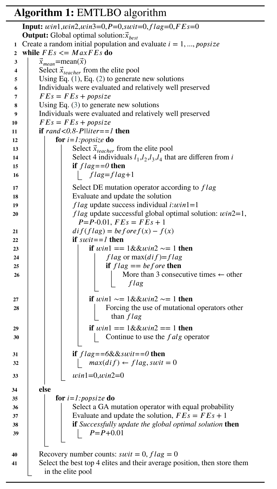
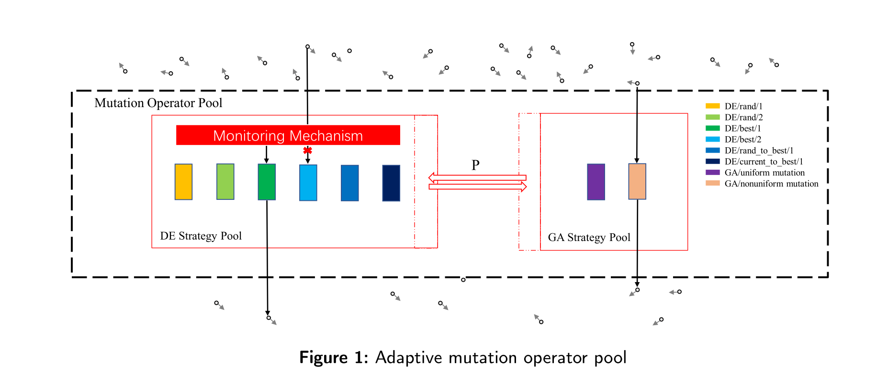
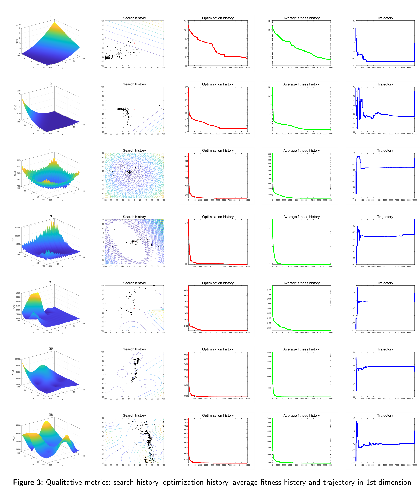

# EMTLBO： An improved teaching-learning-based optimization using adaptive cooperative learning for multiple sequence alignment

## Introduction

Teaching-Learning-Based Optimization (TLBO) is a population-based metaheuristic approach that imitates the process of teaching-leaning between teacher and students and has been applied in many real-world application problems. However, it still suffers from the problem of trapping into local optimum. In this paper an elites-guidance with multiple operators based TLBO (EMTLBO) is proposed. It improves optimization performance through elite guidance and cooperative learning-based adaptive mutation operator pool strategies. Based on historical search conditions, the adaptive mutation operator pool provides different mutation operators to diversify the population and improve integrated convergence performance, while the elite guidance is based on the collaborative guidance of multiple suboptimal solutions to provide different information on the direction of progress. The EMTLBO algorithm was compared with 7 novel metaheuristic algorithms and 5 TLBO improvement algorithms in terms of comprehensive convergence performance on 30 international benchmark test functions of the CEC 2017 test suite. The convergence accuracy results, the Wilcoxon rank sum test results and the Friedman test results show that EMTLBO is able to find high-quality solutions more reasonably and consistently when facing different optimization problems. In addition, to demonstrate that the EMTLBO algorithm can solve high-dimensional complex problems, the algorithm is applied to the Multiple Sequence Alignment (MSA) problem based on Hidden Markov Models (HMM) with desirable results. The source code of EMTLBO algorithm is publicly available at <https://github.com/tsingke/EMTLBO>.

## Algorithm pseudocode

## Performance Review

## Source Code
The source code of EMTLBO algorithm can be downloaded below：

 [EMTLBO Algorithm Code](https://github.com/tsingke/EMTLBO/blob/main/EMTLBO.m)
 
 ## Acknowledgements
 
This work is supported by the National Natural Science Foundation of China (No. 62006144), the Major Fundamental Research Project of Shandong, China (No. ZR2019ZD03), and the Taishan Scholar Project of Shandong, China (No. ts20190924).

**Thank you for taking the time to review our paper and we would like to express our sincere gratitude to you! Best Regards！**
 

